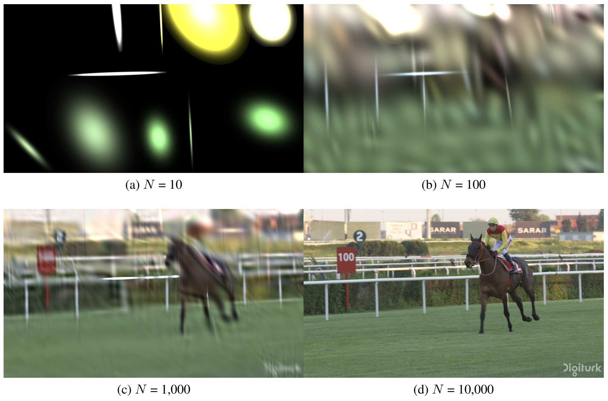
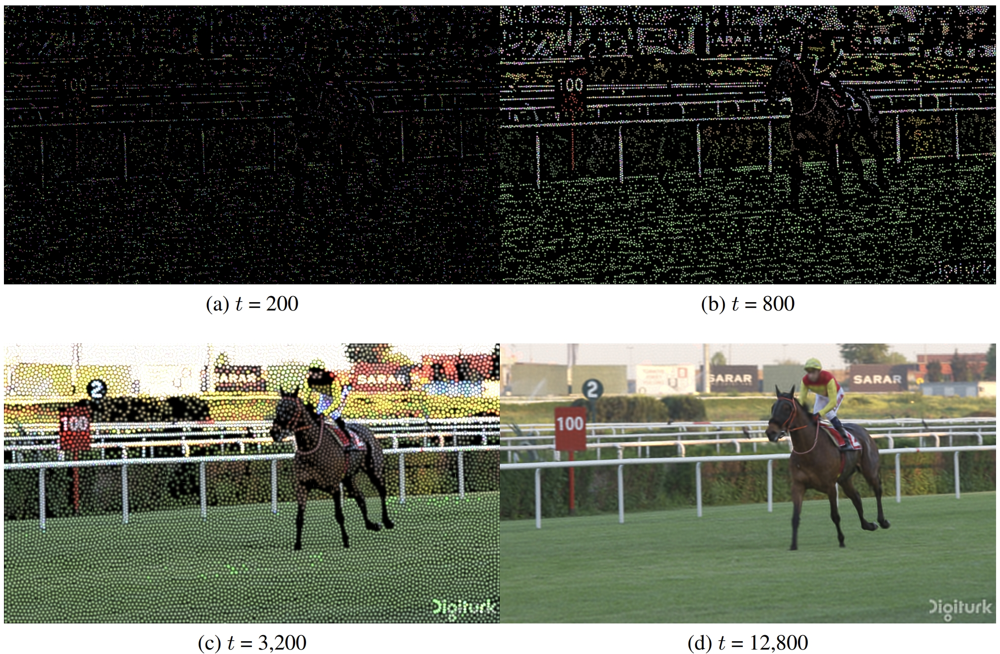

# GSVC: Efficient Video Representation and Compression Through 2D Gaussian Splatting
<!-- [](https://opensource.org/licenses/Apache-2.0)  -->
[](https://arxiv.org/abs/2501.12060)
[](https://github.com/LonganWANG-cs/GSVC)

[[paper](https://arxiv.org/abs/2501.12060)][[project page](https://yuang-ian.github.io/gsvc/)][[code](https://github.com/LonganWANG-cs/GSVC)]

[Longan Wang](https://longanwang-cs.github.io/), [Yuang Shi](https://yuang-ian.github.io/), [Wei Tsang Ooi📧](https://www.comp.nus.edu.sg/~ooiwt/)
(📧 denotes corresponding author.)


This is the official implementation of our paper [GSVC](https://arxiv.org/abs/2501.12060), an approach to learning a set of 2D Gaussian splats that can effectively represent and compress video frames.
GSVC incorporates the following techniques: 
(i) To exploit temporal redundancy among adjacent frames, which can speed up training and improve the compression efficiency, we predict the Gaussian splats of a frame based on its previous frame.
(ii) To control the trade-offs between file size and quality, we remove Gaussian splats with low contribution to the video quality; (iii) To capture dynamics in videos, we randomly add Gaussian splats to fit content with large motion or newly-appeared objects;
(iv) To handle significant changes in the scene, we detect key frames based on loss differences during the learning process.  
Experiment results show that GSVC achieves good rate-distortion trade-offs, comparable to state-of-the-art video codecs such as AV1 and HEVC, and a rendering speed of 1500 fps for a 1920×1080 video.
More qualitative results can be found in our paper.

<figure style="text-align: center;">
  <div>
    
    
    
  </div>
  <figcaption><strong>Figure 1:</strong> Rate-Distortion Curves in PSNR, MS-SSIM, and VMAF: comparison of our approach with baselines.</figcaption>
</figure>

<!-- <figure style="text-align: center;">
  <table style="margin: 0 auto;">
    <thead>
      <tr>
        <th>Bpp</th>
        <th>PSNR</th>
        <th>MS-SSIM</th>
        <th>VMAF</th>
      </tr>
    </thead>
    <tbody>
      <tr>
        <td>0.2076</td>
        <td>33.92983</td>
        <td>0.93157</td>
        <td>87.9589</td>
      </tr>
      <tr>
        <td>0.4132</td>
        <td>35.73157</td>
        <td>0.95497</td>
        <td>93.9834</td>
      </tr>
      <tr>
        <td>0.6198</td>
        <td>36.72493</td>
        <td>0.96263</td>
        <td>94.9507</td>
      </tr>
      <tr>
        <td>0.8176</td>
        <td>37.32610</td>
        <td>0.96688</td>
        <td>95.6774</td>
      </tr>
      <tr>
        <td>1.0424</td>
        <td>37.72213</td>
        <td>0.97000</td>
        <td>96.1375</td>
      </tr>
    </tbody>
  </table>
  <figcaption><strong>Table 1:</strong> GSVC Rate-Distortion Metrics on UVG: PSNR, MS-SSIM, and VMAF.</figcaption>
</figure> -->

<figure style="text-align: center;">
  <table style="margin: 0 auto;">
    <thead>
      <tr>
        <th colspan="4">Beauty</th>
        <th colspan="4">HoneyBee</th>
        <th colspan="4">Jockey</th>
        <th colspan="4">Average</th>
      </tr>
      <tr>
        <th>Bpp</th>
        <th>PSNR</th>
        <th>MS-SSIM</th>
        <th>VMAF</th>
        <th>Bpp</th>
        <th>PSNR</th>
        <th>MS-SSIM</th>
        <th>VMAF</th>
        <th>Bpp</th>
        <th>PSNR</th>
        <th>MS-SSIM</th>
        <th>VMAF</th>
        <th>Bpp</th>
        <th>PSNR</th>
        <th>MS-SSIM</th>
        <th>VMAF</th>
      </tr>
    </thead>
    <tbody>
      <tr>
        <td>0.2125</td>
        <td>33.7269</td>
        <td>0.904</td>
        <td>92.2069</td>
        <td>0.201</td>
        <td>34.6147</td>
        <td>0.9701</td>
        <td>95.1509</td>
        <td>0.2093</td>
        <td>33.4479</td>
        <td>0.9206</td>
        <td>76.5188</td>
        <td>0.2076</td>
        <td>33.9298</td>
        <td>0.9316</td>
        <td>87.9589</td>
      </tr>
      <tr>
        <td>0.4195</td>
        <td>34.2806</td>
        <td>0.9191</td>
        <td>94.0175</td>
        <td>0.3952</td>
        <td>36.890</td>
        <td>0.9813</td>
        <td>96.0004</td>
        <td>0.4251</td>
        <td>36.0241</td>
        <td>0.9645</td>
        <td>91.9323</td>
        <td>0.4133</td>
        <td>35.7316</td>
        <td>0.9550</td>
        <td>93.9834</td>
      </tr>
      <tr>
        <td>0.6076</td>
        <td>34.7044</td>
        <td>0.9282</td>
        <td>94.9662</td>
        <td>0.6046</td>
        <td>37.8373</td>
        <td>0.9846</td>
        <td>96.3033</td>
        <td>0.6472</td>
        <td>37.6331</td>
        <td>0.9751</td>
        <td>93.5826</td>
        <td>0.6198</td>
        <td>36.7249</td>
        <td>0.9626</td>
        <td>94.9507</td>
      </tr>
      <tr>
        <td>0.7736</td>
        <td>35.0211</td>
        <td>0.9343</td>
        <td>95.4926</td>
        <td>0.8147</td>
        <td>38.3599</td>
        <td>0.9862</td>
        <td>96.3471</td>
        <td>0.8645</td>
        <td>38.5973</td>
        <td>0.9799</td>
        <td>95.1927</td>
        <td>0.8176</td>
        <td>37.3261</td>
        <td>0.9669</td>
        <td>95.6774</td>
      </tr>
      <tr>
        <td>1.0092</td>
        <td>35.3899</td>
        <td>0.9404</td>
        <td>95.8623</td>
        <td>1.0395</td>
        <td>38.716</td>
        <td>0.9874</td>
        <td>96.3999</td>
        <td>1.0785</td>
        <td>39.0605</td>
        <td>0.9822</td>
        <td>96.1502</td>
        <td>1.0424</td>
        <td>37.7221</td>
        <td>0.9700</td>
        <td>96.1375</td>
      </tr>
    </tbody>
  </table>
  <figcaption><strong>Table 1:</strong> Rate-Distortion Metrics for Beauty, HoneyBee, Jockey, and UVG in PSNR, MS-SSIM, and VMAF.</figcaption>
</figure>


## News

* **2025/2/1**: 🔥 We release our Python and CUDA code for GSVC presented in our paper. Have a try!

<!-- * **2025/2/1**: 🌟 Our paper has been accepted by NOSSDAV 2025! 🎉 Cheers! -->

## Insight
Figure 2 and Figure 3 illustrate how Gaussian splats can serve as a primitive for representing an image, and how the training process iteratively optimizes the parameters of the Gaussian splats to fit a given image.
<figure style="text-align: center;">
  <div>
    
  </div>
  <figcaption><strong>Figure 2:</strong> Using Gaussian splats to model an image. Image is taken from UVG Jockey video. The sub-figures show that as the number of Gaussian splats N increases, the learned splats increasingly approximate the image’s content.</figcaption>
</figure>

<figure style="text-align: center;">
  <div>
    
  </div>
  <figcaption><strong>Figure 3:</strong> Image taken from UVG Jockey video. Intermediate training results after t iterations for 10,000 Gaussian splats, illustrating how Gaussian splats parameters are optimized to fit the content of a frame.</figcaption>
</figure>

## Overview

We propose a novel video representation and compression framework termed GSVC based on 2D Gaussian splats. Similar to modern video codecs, GSVC categorizes video frames into key-frames (Iframe) and predicted frames (P-frames).
Gaussian splats representation for the I-frame is learned from scratch while,
for P-frames, it is learned incrementally from its previous frame.
The predicted frames allow us to exploit temporal redundancy among the frames.
To allow rate control to trade off between compression rate and quality, GSVC prunes Gaussian splats with low contributions to the frame quality.
To cater to video dynamics, GSVC augments each Pframe with random splats before optimization. Finally, we monitor the loss values when learning the splats of each frame to determine if a frame should be an I-frame or a P-frame. 
This step allows GSVC to detect significant changes in the scene.


## Play with Our Code

### Cloning the Repository

```shell
# SSH
git clone git@github.com:LonganWANG-cs/GaussianVideo.git
```
or
```shell
# HTTPS
git clone https://github.com/LonganWANG-cs/GaussianVideo.git
```
After cloning the repository, you can follow these steps to train GSVC models under different tasks. 

### Requirements

We are using `python version 3.9` and `torch cuda runtime 12.4`. Before running the below code, please make sure `torch` is installed.

```bash
cd gsplat
pip install .[dev]
cd ../
pip install -r requirements.txt
```

If you encounter errors while installing the packages listed in requirements.txt, you can try installing each Python package individually using the pip command.

Before training, you need to download the [UVG](https://ultravideo.fi/dataset.html). 

### Manual Training Example
This repository provides scripts for video representation and compression using Gaussian models. The workflow involves two key steps:

1. **Video Representation:** Overfit a video using Gaussian splatting to obtain a detailed model.
2. **Video Compression:** Compress the overfitted model to reduce file size while maintaining quality.

#### Step 1: Video Representation
Run `train_video_Represent.py` to generate the overfitted model:

```bash
python train_video_Represent.py \
  --loss_type L2 \
  --dataset /home/e/e1344641/data/UVG/Beauty/Beauty_1920x1080_120fps_420_8bit_YUV.yuv \
  --data_name Beauty \
  --num_points 10000 \
  --savdir GaussianVideo_results \
  --savdir_m GaussianVideo_models \
  --iterations 100000 \
  --is_rm --is_ad
```

#### Step 2: Video Compression
Run `train_video_Compress.py` to compress the video using the overfitted model:

```bash
python train_video_Compress.py \
  --dataset /home/e/e1344641/data/UVG/Beauty/Beauty_1920x1080_120fps_420_8bit_YUV.yuv \
  --model_path /home/e/e1344641/GaussianVideo/checkpoints/GaussianVideo_models/Beauty/GaussianVideo_100000_10000/gmodels_state_dict.pth \
  --data_name Beauty \
  --num_points 10000 \
  --savdir GaussianVideo_results \
  --savdir_m GaussianVideo_models \
  --iterations 50000 \
  --is_rm
```

### SLURM Job Scripts

For automated training and compression on SLURM, `.sh` files are provided:

- **Complete Workflow:** Run `sh_train_compression.sh` to perform both representation and compression.

  ```bash
  sbatch sh_train_compression.sh
  ```

- **Representation Only:** Run `sh_train_representation.sh` if you only want to train the model without compression.

  ```bash
  sbatch sh_train_representation.sh
  ```


## Acknowledgments

Our code was developed based on [GaussianImage](https://github.com/Xinjie-Q/GaussianImage). 
This is a paradigm of image representation and compression by 2D Gaussian Splatting.


## Citation

If you find our GSVC useful or relevant to your research, please kindly cite our paper:

```
@article{wang2025gsvc,
  title={GSVC: Efficient Video Representation and Compression Through 2D Gaussian Splatting},
  author={Wang, Longan and Shi, Yuang and Ooi, Wei Tsang},
  journal={arXiv preprint arXiv:2501.12060},
  year={2025}
}
```
