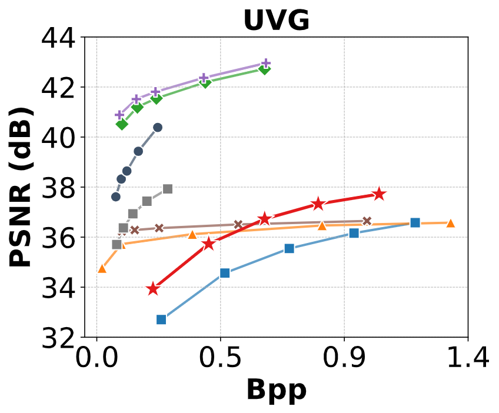
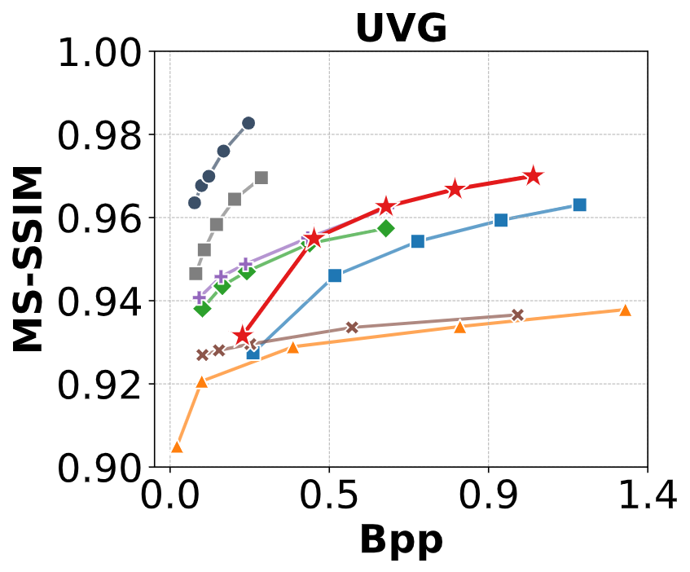
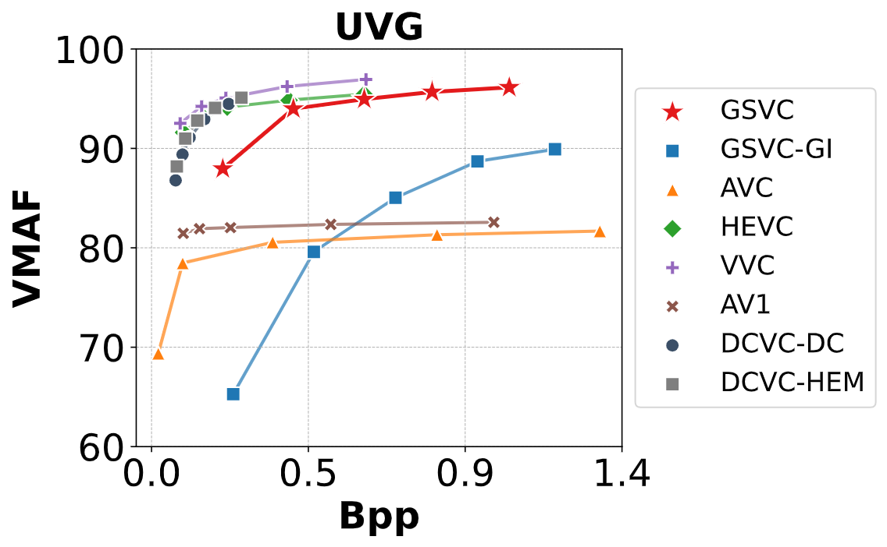

# GSVC: Efficient Video Representation and Compression Through 2D Gaussian Splatting
<!-- [](https://opensource.org/licenses/Apache-2.0)  -->
[](https://arxiv.org/abs/2501.12060)
[](https://github.com/LonganWANG-cs/GSVC)

[[paper](https://arxiv.org/abs/2501.12060)][[project page](https://yuang-ian.github.io/gsvc/)][[code](https://github.com/LonganWANG-cs/GSVC)]

[Longan Wang](https://longanwang-cs.github.io/), [Yuang Shi](https://yuang-ian.github.io/), [Wei Tsang Ooi📧](https://www.comp.nus.edu.sg/~ooiwt/)
(📧 denotes corresponding author.)


This is the official implementation of our paper [GSVC](https://arxiv.org/abs/2501.12060), an approach to learning a set of 2D Gaussian splats that can effectively represent and compress video frames.
GSVC incorporates the following techniques: 
(i) To exploit temporal redundancy among adjacent frames, which can speed up training and improve the compression efficiency, we predict the Gaussian splats of a frame based on its previous frame.
(ii) To control the trade-offs between file size and quality, we remove Gaussian splats with low contribution to the video quality; (iii) To capture dynamics in videos, we randomly add Gaussian splats to fit content with large motion or newly-appeared objects;
(iv) To handle significant changes in the scene, we detect key frames based on loss differences during the learning process.  
Experiment results show that GSVC achieves good rate-distortion trade-offs, comparable to state-of-the-art video codecs such as AV1 and HEVC, and a rendering speed of 1500 fps for a 1920×1080 video.
More qualitative results can be found in our paper.

<figure style="text-align: center;">
  <div>
    
    
    
  </div>
  <figcaption><strong>Figure 1:</strong> Rate-Distortion Curves in PSNR, MS-SSIM, and VMAF: comparison of our approach with baselines.</figcaption>
</figure>


## News

* **2025/2/1**: 🔥 We release our Python and CUDA code for GSVC presented in our paper. Have a try!

<!-- * **2025/2/1**: 🌟 Our paper has been accepted by NOSSDAV 2025! 🎉 Cheers! -->

## Insight
Figure 2 and Figure 3 illustrate how Gaussian splats can serve as a primitive for representing an image, and how the training process iteratively optimizes the parameters of the Gaussian splats to fit a given image.
<figure style="text-align: center;">
  <div>
    
  </div>
  <figcaption><strong>Figure 2:</strong> Using Gaussian splats to model an image. Image is taken from UVG Jockey video. The sub-figures show that as the number of Gaussian splats N increases, the learned splats increasingly approximate the image’s content.</figcaption>
</figure>

<figure style="text-align: center;">
  <div>
    
  </div>
  <figcaption><strong>Figure 3:</strong> Image taken from UVG Jockey video. Intermediate training results after t iterations for 10,000 Gaussian splats, illustrating how Gaussian splats parameters are optimized to fit the content of a frame.</figcaption>
</figure>

## Overview

We propose a novel video representation and compression framework termed GSVC based on 2D Gaussian splats. Similar to modern video codecs, GSVC categorizes video frames into key-frames (Iframe) and predicted frames (P-frames).
Gaussian splats representation for the I-frame is learned from scratch while,
for P-frames, it is learned incrementally from its previous frame.
The predicted frames allow us to exploit temporal redundancy among the frames.
To allow rate control to trade off between compression rate and quality, GSVC prunes Gaussian splats with low contributions to the frame quality.
To cater to video dynamics, GSVC augments each Pframe with random splats before optimization. Finally, we monitor the loss values when learning the splats of each frame to determine if a frame should be an I-frame or a P-frame. 
This step allows GSVC to detect significant changes in the scene.


## Quick Started

### Cloning the Repository

```shell
# SSH
git git@github.com:LonganWANG-cs/GaussianVideo.git
```
or
```shell
# HTTPS
git https://github.com/LonganWANG-cs/GaussianVideo.git
```
After cloning the repository, you can follow these steps to train GSVC models under different tasks. 

### Requirements

```bash
cd gsplat
pip install .[dev]
cd ../
pip install -r requirements.txt
```

If you encounter errors while installing the packages listed in requirements.txt, you can try installing each Python package individually using the pip command.

Before training, you need to download the [UVG](https://r0k.us/graphics/kodak/). 

#### Representation

```bash
sh ./scripts/gaussianimage_cholesky/kodak.sh /path/to/your/dataset
sh ./scripts/gaussianimage_rs/kodak.sh /path/to/your/dataset
sh ./scripts/3dgs/kodak.sh /path/to/your/dataset

sh ./scripts/gaussianimage_cholesky/div2k.sh /path/to/your/dataset
sh ./scripts/gaussianimage_rs/div2k.sh /path/to/your/dataset
sh ./scripts/3dgs/div2k.sh /path/to/your/dataset
```

#### Compression

After overfitting the image, we load the checkpoints from image representation and apply quantization-aware training technique to obtain the image compression results of GaussianImage models.

```bash
sh ./scripts/gaussianimage_cholesky/kodak_comp.sh /path/to/your/dataset
sh ./scripts/gaussianimage_rs/kodak_comp.sh /path/to/your/dataset

sh ./scripts/gaussianimage_cholesky/div2k_comp.sh /path/to/your/dataset
sh ./scripts/gaussianimage_rs/div2k_comp.sh /path/to/your/dataset
```

## Acknowledgments

Our code was developed based on [gsplat](https://github.com/nerfstudio-project/gsplat). This is a concise and easily extensible Gaussian Splatting library.

We thank [vector-quantize-pytorch](https://github.com/lucidrains/vector-quantize-pytorch) for providing the framework to implement residual vector quantization.

## Citation

If you find our GaussianImage paradigm useful or relevant to your research, please kindly cite our paper:

```
@inproceedings{zhang2024gaussianimage,
  title={GaussianImage: 1000 FPS Image Representation and Compression by 2D Gaussian Splatting},
  author={Zhang, Xinjie and Ge, Xingtong and Xu, Tongda and He, Dailan and Wang, Yan and Qin, Hongwei and Lu, Guo and Geng, Jing and Zhang, Jun},
  booktitle={European Conference on Computer Vision},
  year={2024}
}
```
